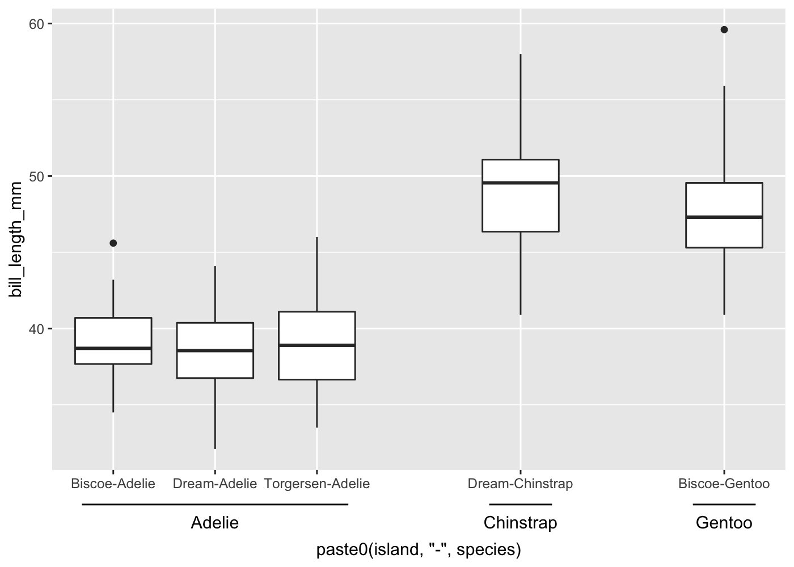

<!-- README.md is generated from README.Rmd. Please edit that file -->

# gggroupedscale

<!-- badges: start -->
<!-- badges: end -->

> :warning: This package is broken (R v4.2). Instead please use [ggh4x](https://teunbrand.github.io/ggh4x/index.html) and see https://github.com/teunbrand/ggh4x/issues/94 how to achieve the grouping behavior.
> The remainder of this README is kept for reference.


`gggroupedscale` is a [`ggplot2`](https://ggplot2.tidyverse.org/)
extensions to easily group categorical variables without resorting to
facets.

For similar functionality, check out the
[`guide_axis_nested`](https://teunbrand.github.io/ggh4x/reference/guide_axis_nested.html)
function in the [ggh4x](https://teunbrand.github.io/ggh4x/index.html)
package.

## Installation

You can install the released version of gggroupedscale from
[Github](https:://github.com/const-ae/gggroupedscale) with:

``` r
devtools::install_github("const-ae/gggroupedscale")
```

## Example

I plot the `bill_length_mm` of the palmer penguins for the different
combinations of species and island. The breaks on the x-axis are grouped
by island

``` r
library(ggplot2)
library(gggroupedscale)
library(palmerpenguins)

ggplot(penguins, 
       aes(x = paste0(island, "-", species), y = bill_length_mm)) +
  geom_boxplot() +
  scale_x_grouped_discrete(grouping = function(x){
    sapply(strsplit(x, split = "-"), function(.x) .x[1])
  }, gap_size = 1, add_group_label = TRUE)
#> Warning: Removed 2 rows containing non-finite values (stat_boxplot).
```


Setting `add_group_label = FALSE` suppresses the additional labels

``` r
ggplot(penguins, 
       aes(x = paste0(island, "-", species), y = bill_length_mm)) +
  geom_boxplot() +
  scale_x_grouped_discrete(grouping = function(x){
    sapply(strsplit(x, split = "-"), function(.x) .x[1])
  }, gap_size = 1, add_group_label = FALSE)
#> Warning: Removed 2 rows containing non-finite values (stat_boxplot).
```


You can also define the grouping using a regular vector or a formula
style function

``` r
ggplot(penguins, aes(x = paste0(island, "-", species), y = bill_length_mm)) +
  geom_boxplot() +
  scale_x_grouped_discrete(grouping = c("A", "B", "A", "B", "C"), add_group_label = TRUE)
#> Warning: Removed 2 rows containing non-finite values (stat_boxplot).
```


``` r
ggplot(penguins, aes(x = paste0(island, "-", species), y = bill_length_mm)) +
  geom_boxplot() +
  scale_x_grouped_discrete(grouping = ~ stringr::str_split_fixed(.x, "-", n=2)[,2], 
                           gap_size = 1, add_group_label = TRUE)
#> Warning: Removed 2 rows containing non-finite values (stat_boxplot).
```



The grouping also works for the y-axis

``` r
ggplot(penguins, aes(x = bill_length_mm, y = paste0(island, "-", species))) +
  geom_boxplot() +
  scale_y_grouped_discrete(grouping = function(x){
    sapply(strsplit(x, split = "-"), function(.x) .x[1])
  }, gap_size = 0.8, add_group_label = TRUE) + 
  labs(y = "")
#> Warning: Removed 2 rows containing non-finite values (stat_boxplot).
```


# Disclaimer

Note that this is not a polished package. For example, the package uses
internal functions from `ggplot2` and has a hack to extend the range, so
it might break with any new release of `ggplot2`. However, it seems to
get the job done, so it’s good enough for me. I am currently not
planning to submit to CRAN and it should probably be rather added to one
of the existing ggplot extension packages that provide custom scales.

# Session Info

``` r
sessionInfo()
#> R version 4.1.1 (2021-08-10)
#> Platform: x86_64-apple-darwin17.0 (64-bit)
#> Running under: macOS Big Sur 10.16
#> 
#> Matrix products: default
#> BLAS:   /Library/Frameworks/R.framework/Versions/4.1/Resources/lib/libRblas.0.dylib
#> LAPACK: /Library/Frameworks/R.framework/Versions/4.1/Resources/lib/libRlapack.dylib
#> 
#> locale:
#> [1] en_US.UTF-8/en_US.UTF-8/en_US.UTF-8/C/en_US.UTF-8/en_US.UTF-8
#> 
#> attached base packages:
#> [1] stats     graphics  grDevices utils     datasets  methods   base     
#> 
#> other attached packages:
#> [1] palmerpenguins_0.1.0 gggroupedscale_0.0.3 ggplot2_3.3.5       
#> 
#> loaded via a namespace (and not attached):
#>  [1] highr_0.9        pillar_1.6.2     compiler_4.1.1   tools_4.1.1     
#>  [5] digest_0.6.27    evaluate_0.14    lifecycle_1.0.0  tibble_3.1.4    
#>  [9] gtable_0.3.0     pkgconfig_2.0.3  rlang_0.4.11     DBI_1.1.1       
#> [13] yaml_2.2.1       xfun_0.26        fastmap_1.1.0    withr_2.4.2     
#> [17] stringr_1.4.0    dplyr_1.0.7      knitr_1.34       generics_0.1.2  
#> [21] vctrs_0.3.8      grid_4.1.1       tidyselect_1.1.1 glue_1.4.2      
#> [25] R6_2.5.1         fansi_0.5.0      rmarkdown_2.11   farver_2.1.0    
#> [29] purrr_0.3.4      magrittr_2.0.1   scales_1.1.1     ellipsis_0.3.2  
#> [33] htmltools_0.5.2  assertthat_0.2.1 colorspace_2.0-2 labeling_0.4.2  
#> [37] utf8_1.2.2       stringi_1.7.4    munsell_0.5.0    crayon_1.4.1
```
